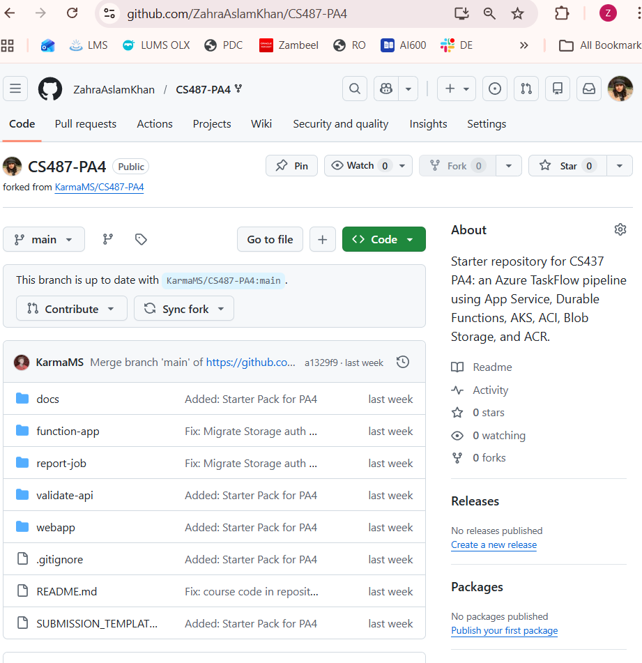

# PA4 Submission: TaskFlow Pipeline

## Student Information

| Field | Value |
|---|---|
| Name | Zahra Aslam Khan |
| Roll Number | 25280093 |
| GitHub Repository URL | https://github.com/ZahraAslamKhan/CS487-PA4 |
| Resource Group | `rg-sp26-25280093` |
| Assigned Region | `ukwest` |

## Evidence Rules

- Use relative image paths, for example: ``.
- Every image must have a 1-3 sentence description below it.
- Azure Portal screenshots must show the resource name and enough page context to identify the service.
- CLI screenshots must show the command and output.
- Mask secrets such as function keys, ACR passwords, and storage connection strings.

---

## Task 1: App Service Web App (15 points)

### Evidence 1.1: Forked Repository

This is my personal fork of the PA4 starter repo at `github.com/ZahraAslamKhan/CS487-PA4`, forked from `KarmaMS/CS487-PA4`. It contains all the required folders: `webapp`, `function-app`, `validate-api`, `report-job`, and `docs`.

### Evidence 1.2: App Service Overview

The Web App `pa4-25280093` is deployed in resource group `rg-sp26-25280093`, region UK West, on App Service Plan `pa4-25280093 (B1:1)` running Linux with Node 22-lts runtime. Status shows **Running** and the public URL is `pa4-25280093.azurewebsites.net`.

### Evidence 1.3: Deployment Center / GitHub Actions

The Web App is connected to GitHub via the Deployment Center. Source is GitHub, organization `ZahraAslamKhan`, repository `CS487-PA4`, branch `main`, with GitHub Actions as the build provider using Node 22-lts runtime.

### Evidence 1.4: Live Web UI

This shows the TaskFlow order form loaded in a browser at `pa4-25280093.azurewebsites.net`. The App Service is successfully serving the frontend — the Submit Order form and Status panel are both visible, confirming the Node.js app deployed and started correctly.

---

## Task 2: Azure Container Registry (15 points)

### Evidence 2.1: ACR Overview

The container registry `pa425280093` is provisioned in resource group `rg-sp26-25280093`, region UK West, on the **Basic** pricing plan. Provisioning state shows **Succeeded** and the login server is `pa425280093.azurecr.io`.

### Evidence 2.2: Docker Builds

Docker Desktop build history shows three successful builds: `validate-api` (2m 21s), `report-job` (7m 21s), and `function-app` (1m 59s). Each image was built from its own subfolder — `validate-api/`, `report-job/`, and `function-app/` respectively — and all three completed with no errors.

### Evidence 2.3: ACR Repositories

The ACR Repositories blade for `pa425280093` lists all three repositories: `func-app`, `report-job`, and `validate-api`. The CLI output below also confirms this via `az acr repository list`.

Running `az acr repository list --name pa425280093 --output table` confirms all three images — `func-app`, `report-job`, and `validate-api` — were successfully pushed to the registry with tag `v1`.

---

## Task 3: Durable Function Implementation (12 points)

### Evidence 3.1: Completed Function Code

[function_app.py](function-app/function_app.py)

The orchestrator in `function_app.py` chains two activities in sequence. First it calls `validate_activity`, which posts the order payload to the AKS validator at `VALIDATE_URL` and returns a `{valid, reason}` response. If the order is rejected the orchestrator returns immediately with `status: rejected`. If it passes, it calls `report_activity`, which uses the Azure SDK to create an ACI running the `report-job` image, polls until the container reaches `Succeeded`, cleans it up with `begin_delete`, and returns the blob URL of the generated PDF. The orchestrator then returns `{status: completed, report_url: ...}`.

### Evidence 3.2: Local Function Handler Listing

This shows the output of running `func start` inside the `function-app/` directory. The Durable Functions runtime discovered and registered all four handlers: `http_starter` (HTTP trigger), `my_orchestrator` (orchestration trigger), `validate_activity` (activity trigger), and `report_activity` (activity trigger). This confirms the function code is structured correctly and the runtime can find all the components.

---

## Task 4: Function App Container Deployment (8 points)

### Evidence 4.1: Function App Container Configuration

The Function App `pa4-25280093` is configured to pull its container image from ACR at `pa425280093.azurecr.io/func-app:v1`. This screenshot shows the container settings or Deployment Center blade confirming the image URI and registry are correctly wired up.

### Evidence 4.2: Orchestration Smoke Test

This is the `curl` response from posting to `https://pa4-25280093.azurewebsites.net/api/orchestrators/my_orchestrator?code=<KEY>` with a test order payload. The response contains an `id` (the orchestration instance ID) and a `statusQueryGetUri`, proving the Function App is running in the cloud and successfully started the Durable orchestration.

### Evidence 4.3: Expected Failed Status Before Downstream Wiring

Polling the `statusQueryGetUri` at this stage shows `runtimeStatus: Failed` with an error about being unable to reach `VALIDATE_URL`. This is expected — `VALIDATE_URL` has not been set yet since the AKS validator is not deployed until Task 5. The failure confirms the orchestrator started, checkpointed, and ran `validate_activity` far enough to attempt the outbound HTTP call.

---

## Task 5: AKS Validator (15 points)

### Evidence 5.1: AKS Cluster

The AKS cluster `pa4-25280093` is provisioned in resource group `rg-sp26-25280093`, region UK West, with 1 node of size `Standard_B2s`. Provisioning state shows **Succeeded**, confirming the cluster is up and `kubectl` can connect to it.

### Evidence 5.2: Kubernetes Nodes and Pods

`kubectl get nodes` shows the single node in **Ready** state, confirming the cluster is healthy. `kubectl get pods` shows the validator pod in **Running** state, meaning the `validate-api:v1` image was pulled from ACR using the pull secret and the container started without issues.

### Evidence 5.3: Kubernetes Service

`kubectl get service validate-service` shows the service type as **LoadBalancer** with an assigned **EXTERNAL-IP** and port 8080 exposed. This is the stable public IP that `validate_activity` in the Durable Function uses to reach the validator on every order.

### Evidence 5.4: Validator API Tests

Three `curl` commands are shown: `GET /health` returns a healthy response, `POST /validate` with `qty: 2` returns `{"valid": true, "reason": "ok"}`, and `POST /validate` with `qty: 999` returns `{"valid": false, "reason": "quantity exceeds limit"}`. This confirms the validator is live on its external IP and correctly enforcing the `qty > 100` rejection rule.

### Evidence 5.5: Function App `VALIDATE_URL`

The Function App `pa4-25280093` application settings show `VALIDATE_URL` set to `http://<external-ip>:8080/validate`, pointing at the AKS LoadBalancer IP. This is how `validate_activity` knows where to send the order payload for validation at runtime.

### Evidence 5.6: AKS Idle Behavior

Even with no orders being submitted, `kubectl get pods` still shows the validator pod in **Running** state and the node stays **Ready**. This is different from ACI — the AKS node VM keeps running and billing continuously whether or not any traffic is hitting the validator, which is the expected behavior for a long-lived service.

---

## Task 6: ACI Report Job (15 points)

### Evidence 6.1: Blob Container

The `reports` blob container exists inside storage account `pa425280093`. This is where the report job writes its output — every order that passes validation produces a file named `<order_id>.pdf` stored in this container.

### Evidence 6.2: Manual ACI Run

`az container show` for `ci-report-test` shows the container instance in **Succeeded** state. The container ran the `report-job:v1` image with `ORDER_ID=TEST-001`, completed its work (generating and uploading the PDF), and exited cleanly. The `Never` restart policy means it runs exactly once and stops.

### Evidence 6.3: ACI Logs

`az container logs` for `ci-report-test` shows the report job's own printed output — lines confirming PDF generation started, the file was created, and it was uploaded to blob storage. This proves the container code ran successfully end-to-end inside the ACI.

### Evidence 6.4: Generated PDF

The `reports` blob container shows `TEST-001.pdf` listed as a blob. This confirms the ACI container wrote its output to blob storage successfully — the filename matches the `ORDER_ID=TEST-001` environment variable that was passed in during the manual test run.

### Evidence 6.5: Function App Managed Identity and IAM

The Function App `pa4-25280093` Identity blade shows the user-assigned managed identity `mi-pa4-25280093` attached under the **User assigned** tab. The Function App needs this identity so that `report_activity` can call the Azure SDK to create ACI containers without storing any credentials in code — `DefaultAzureCredential` picks up the identity automatically at runtime.

### Evidence 6.6: Report App Settings

The Function App application settings show all values needed by `report_activity`: `REPORT_IMAGE` (the ACR image URI for the report job), `ACR_SERVER`, `ACR_USERNAME`, and `ACR_PASSWORD` (masked) for pulling the image, `STORAGE_ACCOUNT_URL` so the container knows where to write the PDF, `REPORT_RG` and `REPORT_LOCATION` for ACI provisioning, `SUBSCRIPTION_ID` for the SDK client, and `AZURE_CLIENT_ID` for the managed identity. All sensitive values are masked.

---

## Task 7: End-to-End Pipeline (15 points)

### Evidence 7.1: Web App Wiring

The Web App `pa4-25280093` application settings show `FUNCTION_START_URL` set to the HTTP starter endpoint with the function key (masked), and `FUNCTION_STATUS_URL` set to the Durable Task status query prefix. These two settings are how the frontend knows where to kick off a new orchestration and where to poll for its current state.

### Evidence 7.2: Happy Path UI

The TaskFlow order form filled with a valid order — SKU `ABC` and qty `2`, which is well within the validator's limit. This is the state just before the Submit button is clicked.

After submitting, the Status panel shows **Running** with a live orchestration instance ID. The frontend is actively polling `FUNCTION_STATUS_URL` and the Durable orchestration is in progress — validation has been called and the report step is either queued or currently creating the ACI.

The Status panel now shows **Completed** with a report URL link. The full pipeline finished — the order passed validation on AKS, an ACI was spawned to generate the PDF, it uploaded to blob storage, and the orchestrator returned the URL back to the frontend for display.

### Evidence 7.3: Backend Participation

The Function App Monitor → Invocations view shows the orchestration run for this order, with both `validate_activity` and `report_activity` listed as successful. The instance ID matches what was shown in the UI, tracing the same order across the full backend.

`az container list` output shows a container instance created for this specific order. This proves `report_activity` used the Azure SDK to spin up a real ACI container for the run — and since `begin_delete` was called at the end, it should show as terminated or already removed.

The `reports` blob container shows the PDF file named after this order's ID. This is the final output of the full pipeline — the ACI wrote this file to storage and the orchestrator returned its URL back to the frontend.

AKS pod logs showing traffic received during this order run, confirming that `validate_activity` successfully reached the AKS LoadBalancer and the validator pod processed and approved the request before the report step ran.

### Evidence 7.4: Reject Path UI

An order was submitted with `qty: 999`, which exceeds the validator's limit of 100. The Status panel shows a **Rejected** message with the reason returned by the validator. No ACI was created — `report_activity` was never invoked because the orchestrator short-circuited as soon as `validate_activity` returned `valid: false`.

---

## Task 8: Write-up and Architecture Diagram (5 points)

### Evidence 8.1: Architecture Diagram

High-level diagram showing the full pipeline flow: User browser → App Service Web App → Durable Function App (containing HTTP Starter, Orchestrator, validate_activity, report_activity) → AKS Validator and ACI Report Job → Blob Storage. ACR supplies images to all three container services, and IAM / Managed Identity governs access across the resource group.

Detailed diagram with labelled arrows for every data flow: HTTPS from the browser, CI/CD deploy from GitHub, start+poll between the Web App and Function App, HTTP /validate call to AKS, SDK-based ACI creation by report_activity, PDF write from ACI to Blob Storage, and dashed image-pull arrows from ACR to the Function App, AKS, and ACI.

---

### Question 8.2: Service Selection

**App Service** was used for the frontend because it is the easiest way to host a Node.js web app on Azure without dealing with any infrastructure. You connect it to your GitHub repo through the Deployment Center and it auto-deploys every time you push — no manual steps needed. It also shares the same `pa4-25280093` App Service Plan (B1) as the Function App, so both run on the same VM and there is no extra cost for a separate plan.

**Durable Functions** handle the orchestration because the pipeline has two steps that must run in order — validate first, then report — and the second step can take up to a minute. A plain function would struggle with that because of execution time limits, and it has no built-in way to remember what already ran if something fails halfway. Durable Functions fix both problems: they checkpoint after each activity, so if the report step fails, the orchestrator already knows validation passed and will not re-run it.

**AKS** runs the validator because it is a service that needs to be alive and reachable at all times — every single order submission triggers an HTTP call to it. Kubernetes gives it a stable LoadBalancer IP, declarative deployment through `deployment.yaml` and `service.yaml`, and proper pod health management. A single `Standard_B2s` node keeps costs reasonable while still giving production-grade container orchestration.

**ACI** handles the report job because it is a one-shot task — it starts, generates a PDF, uploads it to blob storage, and exits. There is no reason to keep a container running between orders. ACI only charges for the actual seconds the container is alive, so a 20-second job costs almost nothing. Keeping this as a permanent Kubernetes pod like the validator would waste compute and money since it would just sit idle between submissions.

---

### Question 8.3: ACI vs AKS

**Idle behavior:** When there are no orders coming in, the AKS cluster keeps running without stopping. The `Standard_B2s` VM node stays powered on, the validator pod stays scheduled, and billing continues whether there are zero requests or a hundred. ACI does not have an idle state in this pipeline at all — the container does not exist until `report_activity` creates it via the SDK, and once the job finishes and `begin_delete` is called, there is nothing left running anywhere.

**Cost behavior:** AKS is the most expensive part of this whole assignment because the VM node runs continuously regardless of usage. Even if the validator gets zero traffic for a full day, you are still paying for the node. ACI on the other hand charges only for the actual runtime of the container — a report job that takes around 20 seconds per order costs almost nothing. If someone spammed the Submit button 1000 times in a minute, ACI would create 1000 short-lived containers and the cost would go up, but only for those actual seconds of runtime. AKS would handle that same spike without any extra cost since the node was already running.

**Operational model:** AKS requires writing and managing Kubernetes manifests, creating ACR pull secrets manually, waiting for a LoadBalancer IP to be provisioned, and keeping an eye on pod health. It is more work to set up but gives stable, predictable infrastructure. ACI is completely fire-and-forget — you call the SDK with the image, environment variables, and resource specs, and Azure handles everything else. There is no cluster to manage, no YAML, and no persistent endpoint, which makes it perfect for batch jobs but not suitable for a service that needs to answer HTTP calls reliably.

---

### Question 8.4: Durable Functions vs Plain HTTP

The first concrete problem is **function timeouts**. The `report_activity` step creates an ACI container and then polls it until it reaches `Succeeded` state, which can take up to a minute. On top of that, `validate_activity` runs before it. If you built this as two plain HTTP functions calling each other in sequence, the whole chain would need to complete within the function's single execution limit, and any network hiccup or slow ACI startup could push it over the edge. Durable Functions solve this by suspending the orchestrator between activities — no single execution has to stay alive for the entire duration of the pipeline.

The second problem is **state persistence**. With plain HTTP functions, if `report_activity` fails mid-way — say the ACI throws an error during container creation — you have no automatic record that `validate_activity` already returned `valid: true`. You would either run validation again unnecessarily, or you would have to build your own database-backed state tracker from scratch. Durable Functions checkpoint the output of every activity automatically, so if the report step is retried, the orchestrator already knows the order was valid and skips straight to report generation without touching the validator again.

---

### Question 8.5: Cost Review

This is the Cost Management → Cost Analysis view scoped to resource group `rg-sp26-25280093`. The AKS cluster is clearly the most expensive resource — the `Standard_B2s` VM node runs continuously from the moment the cluster was created, regardless of how many orders came through. Everything else is much cheaper: the Function App and Web App share the same B1 plan, ACR is on Basic SKU, Blob Storage holds only a few small PDFs, and each ACI container ran for about 20 seconds per order before being deleted by `report_activity`.

---

### Question 8.6: Challenges Faced

**Problem 1 — Node version mismatch breaking the App Service deployment:**
When I first set up the App Service, I selected Node 20 LTS as the runtime stack. The GitHub Actions deployment went through fine but the app kept crashing on startup. After checking the deployment logs in the portal I noticed the issue was a version mismatch — the `package.json` in `webapp/` expected Node 22 features. I went into the App Service configuration, changed the runtime stack to Node 22-lts, saved, and triggered a re-deploy. After that the app came up correctly and the TaskFlow form loaded without issues.

**Problem 2 — AKS validator pod stuck in `ImagePullBackOff`:**
After applying the Kubernetes deployment manifest, the pod would not start and `kubectl describe pod` showed `ImagePullBackOff`. After some digging I realized I had forgotten to create the ACR pull secret before applying the deployment. The pod was trying to pull from `pa425280093.azurecr.io` but had no credentials. I ran `kubectl create secret docker-registry acr-secret ...` with the ACR admin credentials, then deleted and re-applied the deployment. The pod came up as Running shortly after and the validator endpoint started responding correctly.
